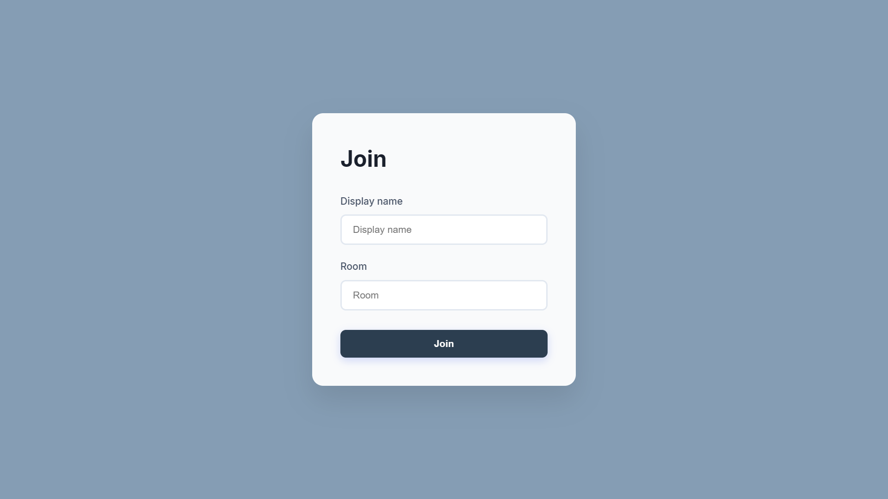

# 💬 Real-Time Chat App

A real-time chat application built with **Node.js**, **Express**, **Socket.io**, and **Mustache.js** for dynamic message rendering. Users can join specific chat rooms, send messages, and share their location with others in the room — all in real time.

---

## 🚀 Features

- 🔗 Join chat rooms with a custom username
- 🧠 Profanity filter using `bad-words`
- 📍 Location sharing via Google Maps links
- 🕐 Real-time message updates using WebSockets
- 🧩 Mustache templates for rendering messages dynamically
- 🧼 Auto-scrolling and user connection/disconnection messages

---

## 🛠️ Tech Stack

- **Backend**: Node.js, Express.js
- **Real-Time Communication**: Socket.io
- **Templating**: Mustache.js
- **Client-Side Tools**: HTML, CSS, JavaScript
- **Extras**: bad-words for profanity filtering, Moment.js for timestamps

---

##  📦 Packages

### Core Dependencies
| Package | Purpose |
|---------|---------|
|  [`express`](https://www.npmjs.com/package/express) | API framework |
| [`mongoose`](https://www.npmjs.com/package/mongoose) | MongoDB ODM |
|  [`socket.io`](https://www.npmjs.com/package/socket.io) | Enables real-time bidirectional event-based communication |
| [`bad-words`](https://www.npmjs.com/package/bad-words) | Filter for badwords |

### Development Tools
| Package | Purpose |
|---------|---------|
| [`nodemon`](https://www.npmjs.com/package/nodemon) | Development server |

### Script Source
| Name | Purpose |
|---------|---------|
| `mustache ` | Web Template System |
| `moment ` | Parsing, validating, manipulating, and formatting dates |
| `qs` | Querystring parsing and stringifying library |

---
### Installation
```bash
# 1. Clone repository
git clone https://github.com/GREED-ED/Chat_App.git

# 2. Install dependencies
npm install

# 3. Start the server
node src/index.js

# 4. Visit in your browser
http://localhost:3000
```
---

## 📸 Screenshot

<p style="text-align: center">Join page</p>
Join page
---------

<p style="text-align: center">Index page</p>

## 🤝 Contributing
Pull requests are welcome.
